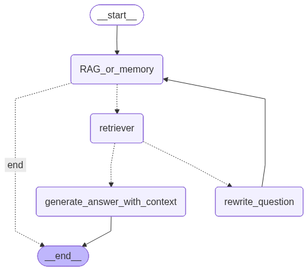

# RAG Agent

**A conversational RAG agent that decides for itself when to retrieve, when to trust its own knowledge, and when to try again** - built with LangGraph and deployed on AWS EC2. Rather than blindly retrieving on every query, the agent uses tool calling to dynamically choose between answering from memory or pulling context from a document knowledge base (about the fictitious company XYZ Corporation), with Gemini models powering both reasoning and retrieval.


---

## Why this architecture

A naive RAG pipeline (embed → search → stuff context → generate) retrieves unconditionally on every query and trusts whatever the vector search returns, even when it's irrelevant. This project addresses both problems with a small feedback loop instead of a single retrieval shot:

- The agent first decides, via tool calling, **whether retrieval is even needed** for a given question - general-knowledge questions are answered directly, without the latency and noise of an unnecessary search.
- Retrieved context is **graded for relevance** before being used. If it doesn't actually answer the question, the agent rewrites the query and retries, up to a capped number of attempts to avoid infinite loops.

This is the same idea behind more sophisticated "self-RAG" / "corrective RAG" approaches, scaled down to a focused, production-deployable implementation.

---

## Architecture

The agent is structured as a LangGraph state graph with the following flow:



### Key components

| Component | Role |
|---|---|
| **LangGraph** | Orchestrates the agent's decision-making graph |
| **Google Gemini** | Powers the LLM and embedding models |
| **FastAPI** | Exposes the agent as a REST API |
| **Amazon S3** | Stores the pre-built vectorstore |
| **AWS EC2** | Hosts the FastAPI application |
| **AWS Secrets Manager** | Securely stores API keys |

---

## Features

- **Dynamic RAG routing** - the agent uses tool calling to decide whether to retrieve context or answer directly from memory
- **Document-based knowledge base** - built from a custom `.docx` file, chunked and vectorized with Gemini Embeddings
- **Question rewriting** - if retrieved context is not relevant, the agent reformulates the question and retries
- **Retry limit** - prevents infinite loops by capping the number of rewrite attempts
- **Web interface** - a lightweight static frontend lets anyone ask questions directly, without constructing API URLs by hand
- **REST API** - exposes the agent via a FastAPI endpoint
- **EC2 deployment** - runs as a persistent systemd service on AWS EC2
- **Secure configuration** - API keys managed via AWS Secrets Manager

---

## Tech Stack

- [LangGraph](https://github.com/langchain-ai/langgraph) - agent graph orchestration
- [LangChain](https://github.com/langchain-ai/langchain) - LLM tooling and document loaders
- [Google Gemini](https://ai.google.dev/) - LLM (`gemini-2.5-flash-lite`) and embeddings (`gemini-embedding-001`)
- [FastAPI](https://fastapi.tiangolo.com/) + [Uvicorn](https://www.uvicorn.org/) - REST API
- [Pydantic](https://docs.pydantic.dev/) - structured outputs and data validation
- [boto3](https://boto3.amazonaws.com/v1/documentation/api/latest/index.html) - AWS SDK (S3, Secrets Manager)
- Vanilla HTML/CSS/JS - lightweight frontend served directly by FastAPI's `StaticFiles`

---

## Project Structure

```
RAGAgent/
├── api.py               # FastAPI application entry point, secrets loading
├── graph.py             # LangGraph pipeline definition
├── nodes.py             # Graph node functions (RAG_or_memory, rewrite_question, generate_answer_with_context)
├── agents.py            # Model initialization and structured output definitions
├── tools.py             # retrieve_context tool definition
├── vectorstore.py       # Vectorstore loading from S3
├── config.py            # Centralized configuration (region, chunk size, retriever k...)
├── static/              # Web interface served at the root URL
├── state.py             # Custom Graphstate to implement a rewrite_count
├── docs/                # Document about XYZ Corporation
└── requirements.txt     # Python dependencies
```

---

## AWS Deployment

The application is deployed on an AWS EC2 instance (`t3.micro`, free tier) with the following setup:

| Service | Usage |
|---|---|
| **EC2** (`t3.micro`) | Hosts the FastAPI application via systemd |
| **S3** | Stores the pre-built `vectorstore.json` |
| **Secrets Manager** | Stores `GOOGLE_API_KEY` and `S3_BUCKET` |
| **IAM Role** | Grants the EC2 instance access to S3 and Secrets Manager |
| **Elastic IP** | Provides a static public IP address |
| **Security Group** | Opens port 8000 (API) and port 22 (SSH) |

The application starts automatically on instance boot and restarts on failure thanks to systemd.

---

## Usage

The agent is live and publicly accessible through a simple web page - no installation, no API calls to construct by hand:

**🔗 [http://13.63.207.94:8000/](http://13.63.207.94:8000/)**

The knowledge base is built from the document available in the [`/docs`](docs/) folder - feel free to read it and try asking questions about its content, or about information that is deliberately not covered in it (e.g. *"Who was the founder of XYZ Corporation?"*). The page handles the API call, URL encoding, and error states automatically.

> The agent answers general knowledge questions from memory, and retrieves context from the XYZ Corporation knowledge base for company-specific questions.

<details>
<summary>API reference (for technical readers)</summary>

The web interface calls a single backend endpoint under the hood:

### `GET /query`

| Parameter | Type | Description |
|---|---|---|
| `question` | string (query param) | The user's question |

```
http://13.63.207.94:8000/query?question=Who+was+the+founder+of+XYZ+Corporation%3F
```

Response:
```json
{"answer": "XYZ Corporation was founded by Sir Oner Donovan in 1765..."}
```

### `GET /health`

Liveness check, used to confirm the service is running.

```json
{"status": "ok"}
```

</details>

---

## Known Limitations


- **No authentication** - the API is publicly accessible to anyone with the IP. An API key or authentication layer should be added for production.
- **In-memory vectorstore** - `InMemoryVectorStore` loads the entire vectorstore into RAM on startup. For large document collections, a persistent vector database (e.g. Pinecone, pgvector) would be more appropriate.
- **Single document knowledge base** - the current setup is designed for a single `.docx` file. Multi-document support would require updates to the ingestion pipeline.

---

## About

Built by **Nicolas Perion** - [LinkedIn](https://www.linkedin.com/in/nicolas-perion/) · [Email](mailto:nicolas.perionquemeneur@essec.edu)
